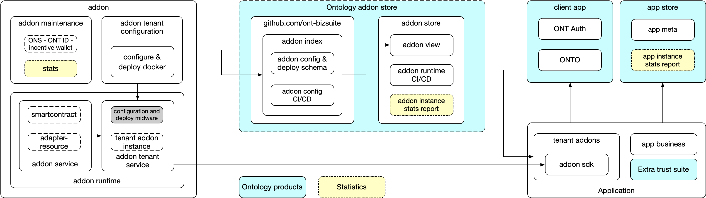
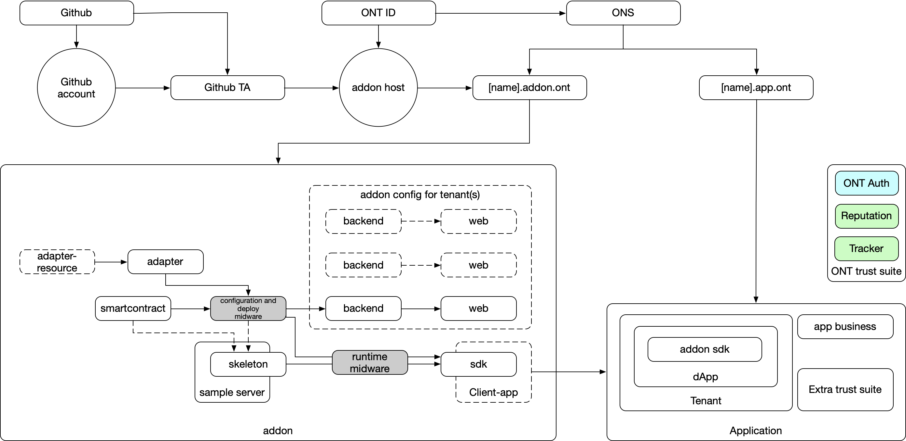
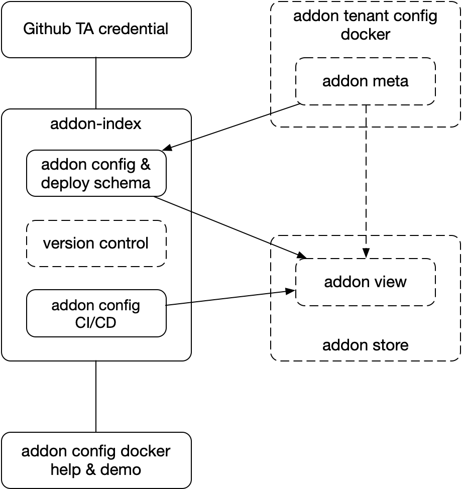
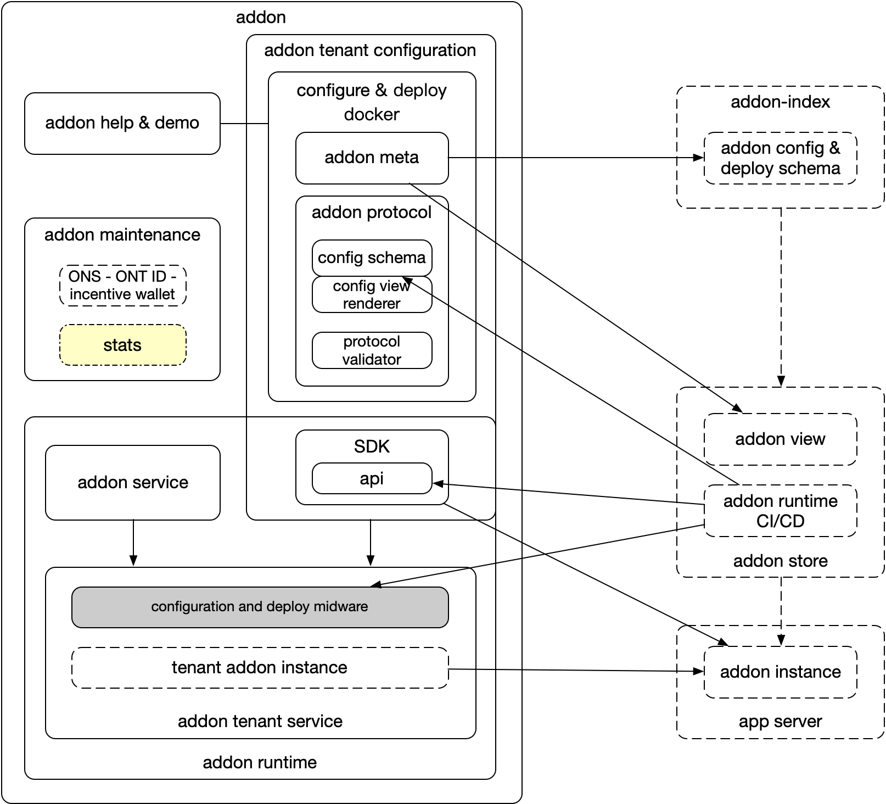
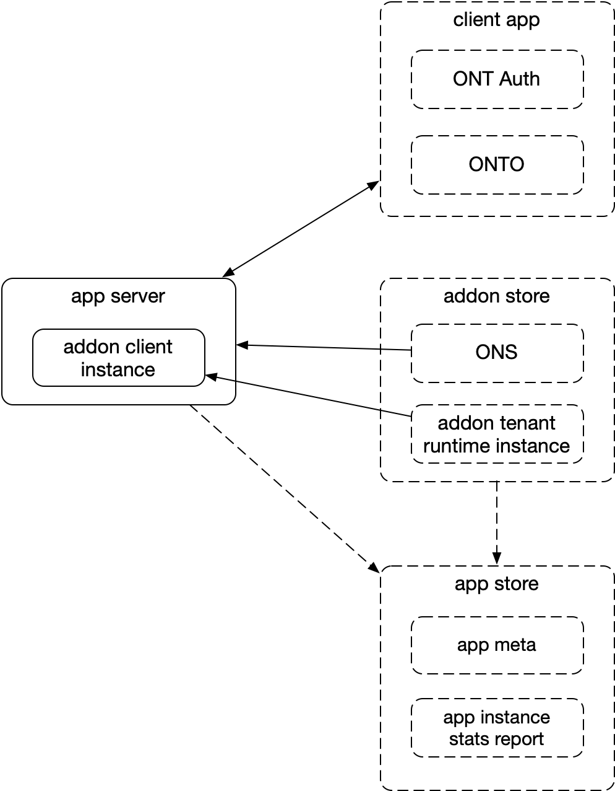
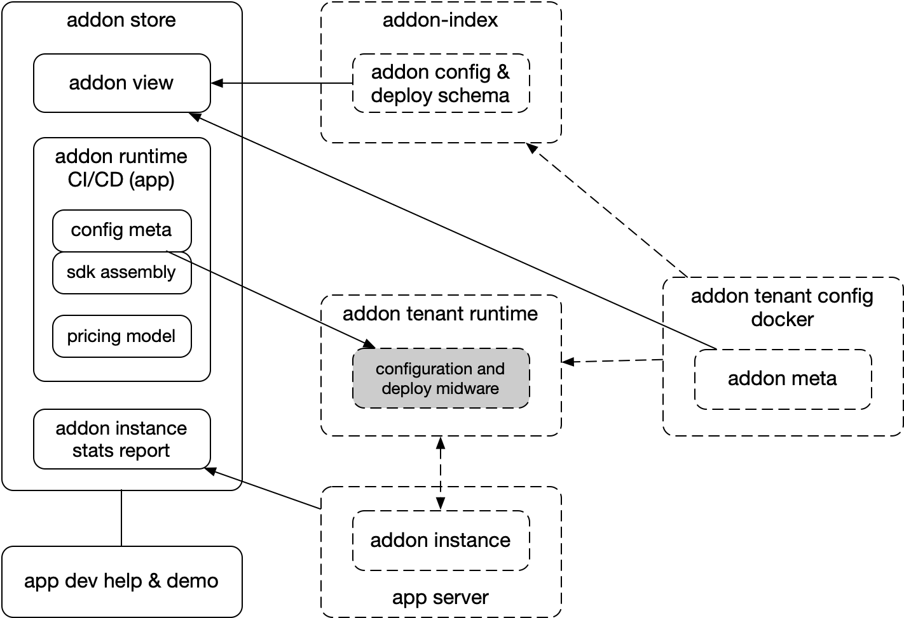
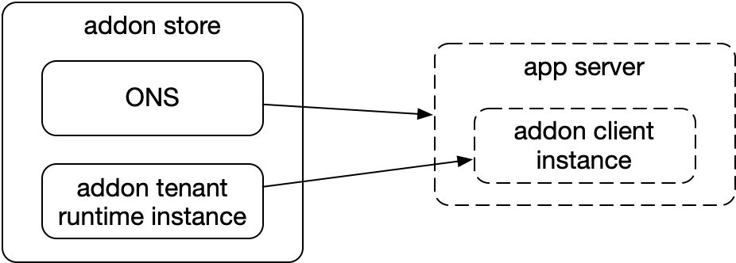

# Ontology addon 概览

[TOC]

## 1. Overview

### 1.1 结构

### 1.2 SSI账户关联

## 2. 组件

### 2.1 Addon index

- Addon-index 是 addon store 组成部分，为 addon store 提供和管理 addon 源，使用 github.com 源管理方式；
- Addon store 通过 github trust anchor 的方式保存 github 账户和 ONT ID 的关联关系；
- Addon-index 包含对 addon租户的配置和管理的元数据规约；
- Addon-index CI/CD 模块为addon store生成addon租户的config和deploy运行实例，被addon store自动化加载；
- Addon-index 需要支持addon的版本管理、向下兼容和平滑升级；
- Addon-index 提供配置和部署docker相关的协议说明、样例。

### 2.2 Addon

- Addon 的开发基于addon store的协议；
- Addon 的开发支持配置管理和租户运行时；
- Addon 的配置管理以docker的形式提供给addon-index，addon store自动生成addon配置管理运行实例；
- Addon 提供租户api，以不同语种sdk实现，或协议描述； 
- Addon 可以使用addon store的功能在配置和部署管理的过程中使用签发链上合约或链上支付逻辑；
- Addon 可以在addon内部自行定义付费服务（类似苹果应用内消费）；
- Addon 支付过程中，可以使用 DDXF 协议，将 addon store 作为 marketplace；
- Addon 可以提供（横向）addon租户runtime组件统计报表，交给addon store显示；
- Addon 支持addon租户runtime sdk自动组装；
- Addon 在runtime的环境准备（部署）和addon config过程中，建议支持基于业务执行的探针（Probe）；
- Addon 需要考虑支持租户不同应用的不同版本运行时的维护，同时支持版本管理、向下兼容和平滑升级；
- Addon 支持租户不同runtime运行环境，定制的环境注册到 addon store，如，测试实例、生产实例；
- Addon 建议支持租户环境的复制或迁移脚本，脚本支持交互；
- Addon 开发者在github TA认领后，自动绑定 addon.ont 域名，长久有效；
- Addon 提供租户addon使用的配置和开发相关的协议说明、样例。

### 2.3 Application

- Application 可以使用本体数字身份相关移动端应用，可以注册到addon store中，可以使用addon store配套的app store服务；
- 数字身份移动端应用提供SSI（身份自治）服务，支持分布式身份和账户管理；
- Addon store 提供app.ont的ONS域名绑定服务，提供不同的addon为开发服务；
- App store 支持链上数据、以及addon store相关addon使用统计数据的反馈，支持application的展示，支持本体用户的导流。

### 2.4 Addon store

#### 2.4.1 addon store - addon

- Addon store 为用户管理应用和应用之下的addon；
- Addon store 根据 addon-index 获得addon配置管理运行实例；
- Addon store 支持addon config自动化配置渲染；
- Addon store 能够接入（横向）addon租户runtime组件统计报表；
- Addon store 支持addon租户runtime sdk自动组装；
- Addon store 支持addon使用的收费（类似苹果appstore应用收费）；
- Addon store 支持驱动addon runtime的环境准备（部署）和addon config过程的互动；
- Addon store 需要支持租户应用不同版本的addon管理；
- Addon store 支持租户不同runtime运行环境，由 addon 定制环境，如，测试实例、生产实例；
- Addon store 支持调用租户环境的复制或迁移脚本，脚本支持交互；
- Addon store 提供租户addon使用的配置和开发相关的协议说明、样例。

#### 2.4.2 addon store - app

- Addon store 协助用户开发app，提供addon使用，为用户的应用注册 ONS，以app.ont为顶级域名；
- 一个应用一个ONS；
- 对于测试网使用，ONS免费注册；对于主网使用，ONS按照年付费管理，费率待定；
- 测试网ONS有效期为3个月，3个月之内必须切换一个主网版本，未发布主网版本，则addon store收回ONS；
- 一旦发布主网，测试网ONS有效期跟随主网ONS，主网ONS续费则测试网ONS自动续期。

### 2.5 App store

- App store 展示application；
- App store 收集application数据；
- App store 收集链上数据；
- App store 收集addon store对于app使用addon的数据；
- App store 支持对于数据的分析；
- App store 是DDXF的一类扩展，提供marketplace服务。

## 3. 接口和协议

| 角色 | 名称        |  描述 |
| ----------- | ----- | ------ |
| Addon-index | CI/CD架构、工作流程和标准协议 |        |
|  | addon configuration meta schema | |
|  | docker接口协议 | 含addon store配置和渲染描述协议 |
|  | PR审批和addon store部署流程 | |
| | addon runtime交互协议（Client端） | |
| | addon runtime交互实现校验方法（Client端） | |
| | addon版本管理办法 | |
| | addon运行环境切换脚本规范 | |
| | addon租户资费管理办法 | |
| Addon | addon runtime运行时业务探针管理办法 | |
|  | addon runtime租户环境管理办法 | |
|  | addon runtime运行时统计数据反馈办法 | |
|  | addon 运行时资费管理办法 | |
| | addon 运行时版本管理办法 | 向下兼容、平滑升级 |
| [Addon store](../en/addon-store/Add-on store usage.md) | addon store 资费和管理协议 | addon 或 addon store 使用，使用DDXF |
|  | addon store 对app.ont ONS管理办法 | |
|  | [addon store加载addon方案](../en/addon-store/Addon Deployment and Update Guide.md) |  |
|  | addon store对addon环境注册协议和管理办法 | 注册环境、环境迁移脚本、迁移资费等 |
|  | addon store对addon配置schema渲染协议 | (load) pre-rendering=>fill-in-form=>render=>post-rendering |
| | addon store对addon配置交互协议 | 支持构造交易签名、付费、配置步骤依赖等 |
| | addon store对addon配置部署联动协议 | 根据配置启动addon租户环境部署，根据环境、业务探针的反馈实现部署和配置的联动。部署包含CUD操作 |
| | 应用对addon版本管理方法 |  |
| | 租户资费统计报表管理办法 | 根据addon内部、部署等生成基于用户》应用》addon的资费和明细，支持资费管理协议迭代更新 |
| | addon统计数据展示协议 | 横向addon使用统计，全站应用统计等 |
| App store | addon推荐 | 注册应用 |
|  | 链上数据统计办法 |  |
|  | addon store数据统计办法 |  |

## 4. 开发标准

## 5. 已有addon

| 名称 | 备注 |
| ---- | ---- |
|[签名机](./addons/signing/README.md)| |
|[存证服务](./addons/attestation/README.md)| |
|[节点代运营](./addons/triones-node-ops/README.md)| |
|[联盟链快速部署](./addons/consortium-chain/README.md)| |
|[可验证凭证发布](./addons/verifiable-credential-issue/README.md)| |
|[可验证凭证使用](./addons/verifiable-credential-consume/README.md)| |
|[数据托管](./addons/data-storage-delegate/README.md)| |
|[数据交易卖家发布](./addons/data-service-provider/README.md)| |
|[数据交易市场](./addons/data-service-marketplace/README.md)| |
|[数据众筹服务](./addons/data-service-crowd-sourcing/README.md)| |
|[数据资产管理](./addons/asset-management/README.md)| |
|[Initial Token Offering](./addons/initial-token-offering/README.md)| |

## 6. Addon 使用场景

| 名称                         | 备注 |
| ---------------------------- | ---- |
| 发布数据储存服务             |      |
| 发布数据                     |      |
| 发布数据服务                 |      |
| 发布数据资源撮合服务         |      |
| 应用去中心化账户改造         |      |
| 应用整合虚拟资产支付         |      |
| 应用为用户提供信任背书（VC） |      |
| 应用本体用户导流             |      |
| 应用获取一定资质的用户导流   |      |
| 应用业务上链                 |      |

## Appendix I. Q&A

| 名称                                                         | 备注 |
| ------------------------------------------------------------ | ---- |
| [QnA for Ontology Business Suite](./misc/QnA for Ontology Business Suite.md) |      |

