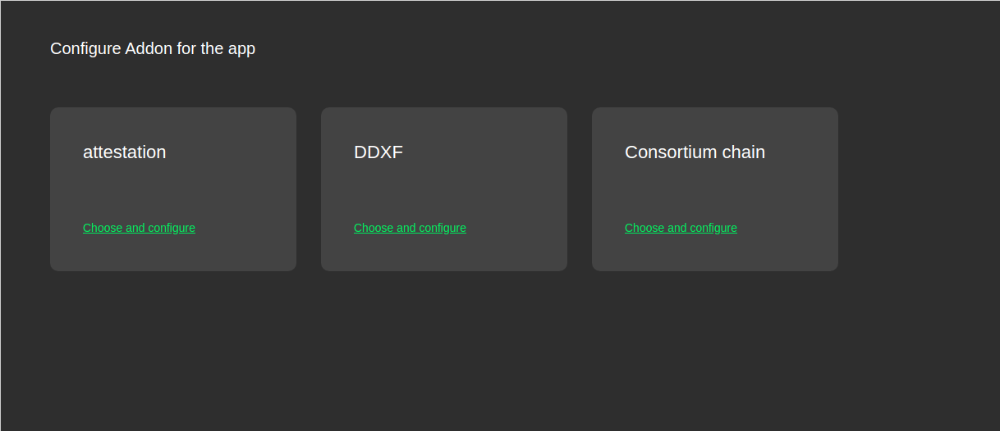
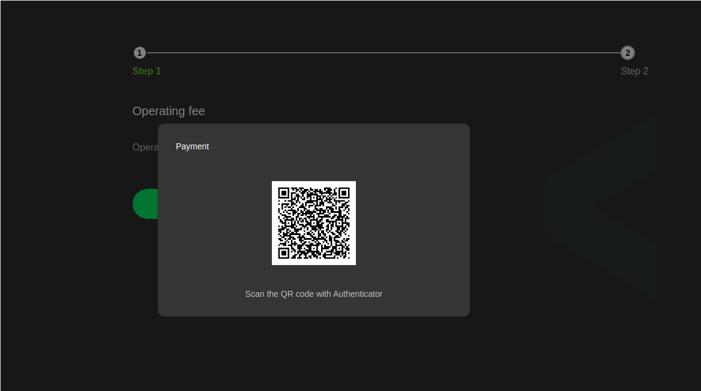
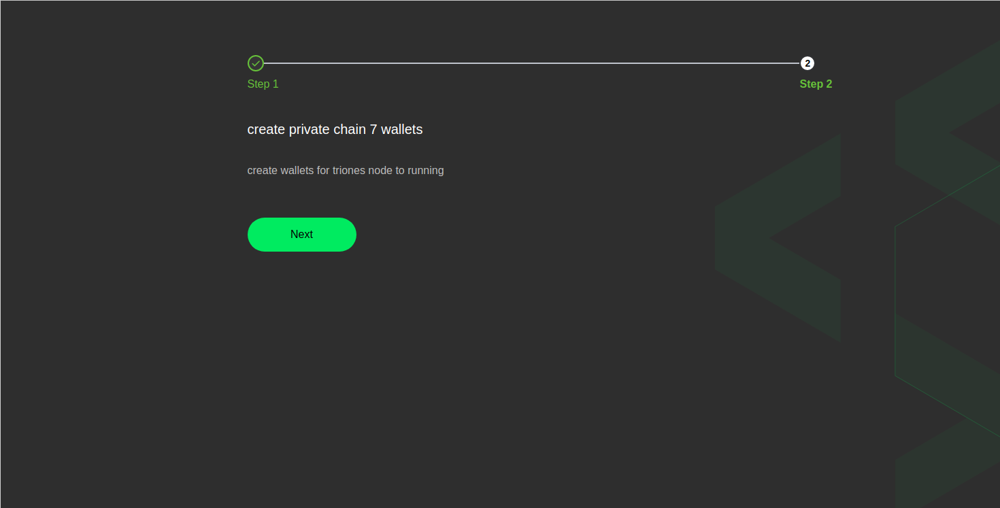
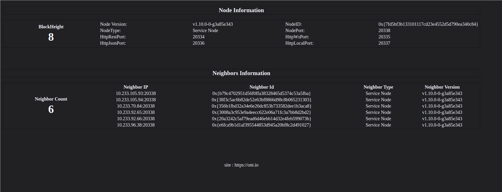

| 属性            | 内容 |      |
| --------------- | ---- | ---- |
| 名称            |      |      |
| 绑定ONS         |      |      |
| 描述            |      |      |
| 版本            |      |      |
| addon-index描述 |      |      |
| addon host      |      |      |
| 协议描述        |      |      |
| SDK             |      |      |
| pricing model   |      |      |
| 适用环境        |      |      |
| 文档            |      |      |
| 样例            |      |      |
| 视频            |      |      |

## 逻辑结构
此addon方便用户快速部署联盟链。

## 调用流程
1. addon扣费

2. 生成7个部署钱包

3. 调用k8s接口部署对应的7个节点

## 部署方案
部署采用的是k8s的statefulset方案，chain放在外挂volume中保证数据POD重启不丢失。另外对于节点的发现利用了k8s DNS对statefulset的解析，从而方便生成对应的配置文件。
## 协议
和k8s的交互遵循k8s开放接口规范，此addon本身的交互请参考addon的调用流程。
