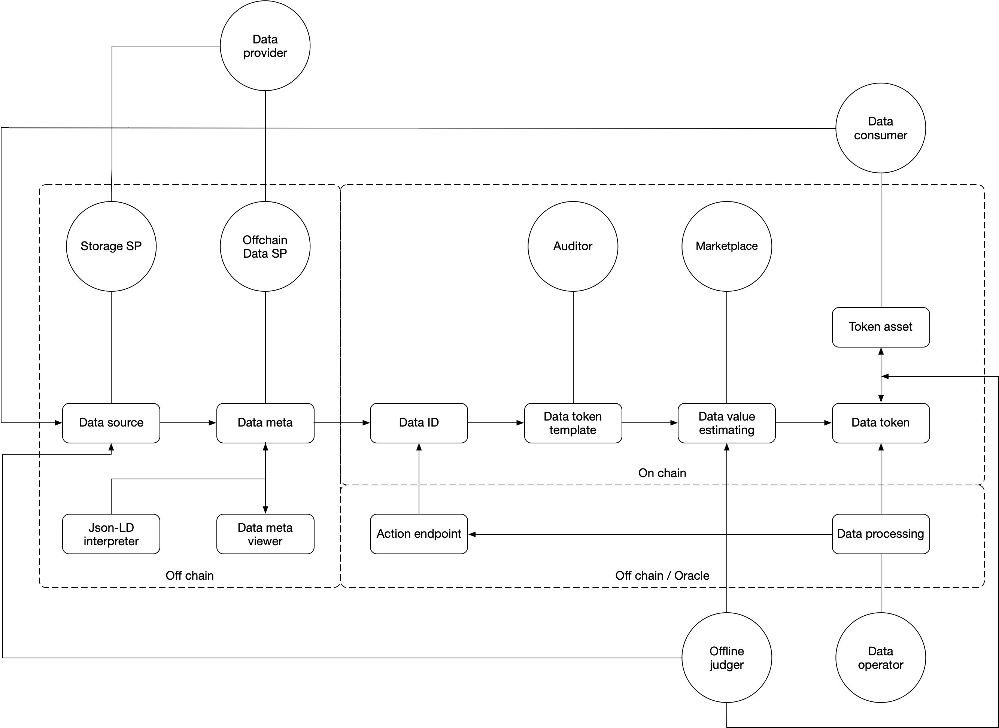
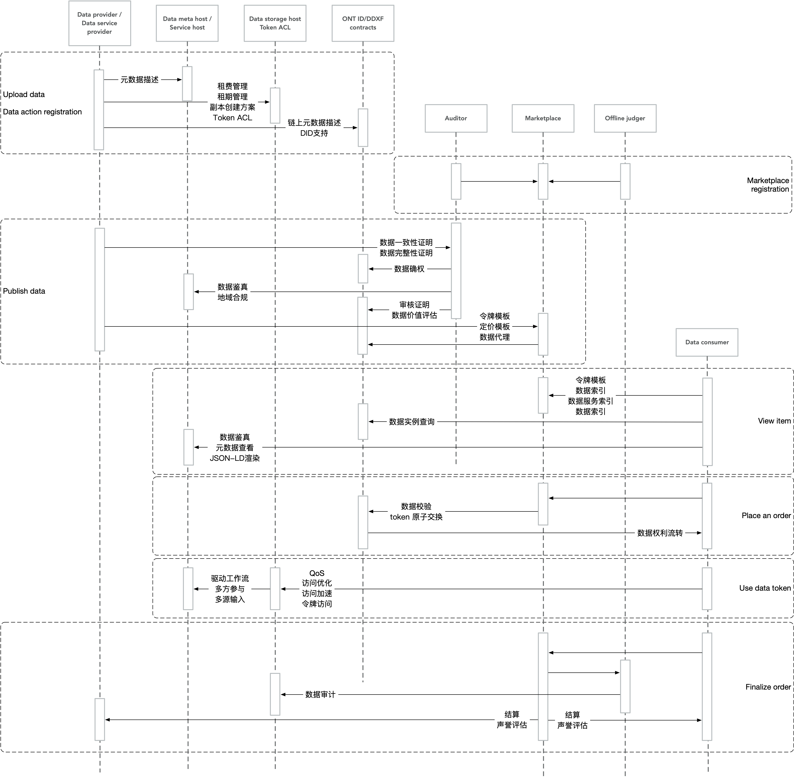
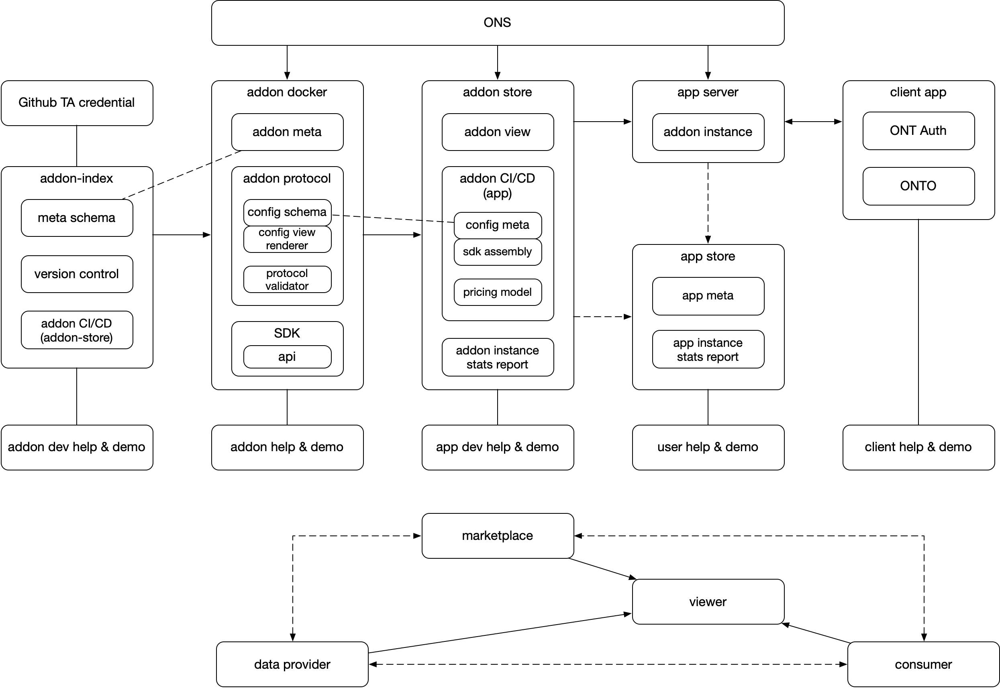

# Q&A for Ontology Business Suite

## What is the DDXF? 

Data business based on DDXF

Workflow of DDXF marketplace

## What is addon store?

Development product based on DDXF

## How to publish your own addon?

1. Create docker file for your addon
   1. Docker spec
2. Create pull request to addon-index of ont-bizsuite
3. Register and login to addon store
4. Get github claim of your account, link with your ONT ID
5. Github contributions will in addon list under your ONT ID

## What does Saga market do with DDXF components and protocols?

1. Publish data
   1. Choose data storage provider
      1. Lookup ONS for CTYPE storage://xxx
   2. Save data to data storage
   3. Choose data service provider
      1. Lookup ONS for CTYPE data://xxx
   4. Choose marketplace
      1. Lookup ONS for CTYPE market://xxx
   5. Generate data meta based on meta schema of marketplace
      1. Merge multiple meta to meet the requirement of multiple marketplaces, if necessary
      2. Save meta to data service
   6. Generate DToken schema and push to marketplace
      1. Wait for audit if marketplace requires
      2. Publish to marketplace if auditing passed
         1. Marketplace get DToken schema, get data ID based on DToken, get data meta based on data ID
         2. Marketplace cache meta of data and DToken schema
         3. Marketplace provide query, recommendation, tagging services based on cache
2. Search and view data
   1. Marketplace provide accepted data meta schema
   2. Marketplace provide data meta rendering if specified
   3. Marketplace provide query api, get query result, in form of DToken schema list, from cache
   4. Marketplace provide query and list rendering if specified
   5. Marketplace check the liveness of off-chain data meta continuously and update its cache
   6. For any query from Saga
      1. Call marketplace query api
      2. Get data meta of query result
         1. If user trust the marketplace, use marketplace cache
         2. If not, get data meta from Ontology mainnet, in terms of DToken schema -> data ID -> data meta
      3. Render result list
      4. Render data meta and DToken schema detail for each item
3. Purchase data
   1. Verify token
   2. Generate DToken based on DToken schema
   3. Exchange DToken with token (predefined price)
   4. Publish transaction on chain
   5. Get result
   6. Notify roles for the purchase, with ONT Auth
   7. Close the order with certain conditions
      1. Wait for consumer to accept the data resource, consumer can close the order anytime
      2. Wait for timeout of order protection period, which is pre-defined by the marketplace. After timeout, data provider can close the order
      3. Wait for the result of arbitration, close the order from the offline judger
4. View data
   1. Verify DToken
   2. Generate data access token based on DToken
   3. Update DToken if necessary
   4. Use data access token to access real data resource in data storage
5. History
   1. Marketplace save view history, chart, and purchase cache
      1. Get info and have info rendered
   2. Self-sovereign Saga client, e.g., ONTO / ONT Auth, save purchase history
      1. Get info and have info rendered
6. Arbitration and offline judgement
   1. In order protection period, for the following errors, consumer can call for an arbitration
      1. Invalid DToken
      2. Invalid data meta
      3. Invalid data resource
      4. Mismatch from data resource to data meta
      5. Unqualified data resource
      6. Others
   2. Offline judger collect evidence of the order, the DToken, data ID, data meta and data resource, and generate the result
   3. Fee split based on the result

## How to serve as a data storage provider in 30 minutes?

1. Open Ontology addon store. https://store.dev.ont.io/
   1. Download ONT Auth if necessary
   2. Create ONT ID if you don't have one
2. Scan the QRCode with ONT Auth and login
   1. Haven't registered? Just sign up by scan the QRCode again
3. Create your application in Ontology testnet
   1. Choose a domain of your application, which will be registered to ONS (Ontology Name Service)
      1. The domain will be live for 3 months, you should publish to mainnet within 3 months
      2. The mainnet domain cost XXX ONG/3 months, you should renew before it expires
      3. The domain expiration date of testnet will be the same as mainnet, it will renew the time the domain is renewed in mainnet 
   2. Keep the WIF of your application
4. Choose signing addon to enable decentralized account system
   1. Configure
      1. Whether to log on-chain
      2. New actions to verify by signature
   2. Download SDK
   3. Develop and publish
   4. Test
5. Choose claim (consumer) addon to enable decentralized user customization, if you want
   1. Configure
      1. Accepted claim template(s)
   2. Download SDK
   3. Develop and publish
   4. Test
      1. Get claim based on claim template(s)
      2. Verify
   5. Create request to claim store(s) for new user
      1. Register to claim store(s)
      2. Create request
      3. Publish (testnet for test, mainnet to charge fee for real users)
6. Choose claim (issuer) addon to enable decentralized user credentials for other application partners, if you want
   1. Configure
      1. Issued claim schema(s)
   2. Download SDK
   3. Develop and publish
   4. Test
      1. Issue
      2. Verify
7. Choose data storage addon to enable storage
   1. Configure
      1. Storage configuration
      2. Acceptable DToken types
   2. Download SDK
   3. Develop and publish
      1. Upload data
      2. Download data
      3. Get paid by certain period of time
   4. Register the published test site with CTYPE "storage" under testnet ONS
   5. Test with Saga Marketplace (testnet)
      1. User registration
      2. Select data storage service provider
      3. Upload data
      4. Download data
8. Publish to mainnet
   1. One-click publish
      1. New application ONT ID on your own
      2. Domain registration
      3. Published released service(s)
      4. CTYPE "storage" registration of newly published service(s)
   2. Test with Saga Marketplace (mainnet)
   3. Add to Saga Marketplace storage-index, if you want
      1. Call AddToStorageIndex() in smart contract
9. Further
   1. Integrate storage client with browsers and ONTO clients

## How to serve as a data service provider in 30 minutes?

1. Open Ontology addon store. https://store.dev.ont.io/
   1. Download ONT Auth if necessary
   2. Create ONT ID if you don't have one
2. Scan the QRCode with ONT Auth and login
   1. Haven't registered? Just sign up by scan the QRCode again
3. Create your application in Ontology testnet
   1. Choose a domain of your application, which will be registered to ONS (Ontology Name Service)
      1. The domain will be live for 3 months, you should publish to mainnet within 3 months
      2. The mainnet domain cost XXX ONG/3 months, you should renew before it expires
      3. The domain expiration date of testnet will be the same as mainnet, it will renew the time the domain is renewed in mainnet 
   2. Keep the WIF of your application
4. Choose signing addon to enable decentralized account system
   1. Configure
      1. Whether to log on-chain
      2. New actions to verify by signature
   2. Download SDK
   3. Develop and publish
   4. Test
5. Choose claim (consumer) addon to enable decentralized user customization, if you want
   1. Configure
      1. Accepted claim template(s)
   2. Download SDK
   3. Develop and publish
   4. Test
      1. Get claim based on claim template(s)
      2. Verify
   5. Create request to claim store(s) for new user
      1. Register to claim store(s)
      2. Create request
      3. Publish (testnet for test, mainnet to charge fee for real users)
6. Choose claim (issuer) addon to enable decentralized user credentials for other application partners, if you want
   1. Configure
      1. Issued claim schema(s)
   2. Download SDK
   3. Develop and publish
   4. Test
      1. Issue
      2. Verify
7. Choose data service addon to enable decentralized data processing
   1. Configure
      1. Data meta schema
      2. Acceptable DToken types
      3. Workflow
   2. Download SDK
   3. Develop and publish
      1. Data meta schema
      2. Dats ID support from data storage
      3. Data processing endpoint registration
         1. Data processing algorithms
   4. Register the published test site with CTYPE "data" under testnet ONS
   5. Test with Saga Marketplace (testnet)
      1. User registration
      2. Generate data ID based on data source
      3. Verify data IDs with data meta and data source
      4. ID based data token validation
      5. Data processing based on data token with data ID
8. Publish to mainnet
   1. One-click publish
      1. New application ONT ID on your own
      2. Domain registration
      3. Published released service(s)
      4. CTYPE "data" registration of newly published service(s)
   2. Test with Saga Marketplace (mainnet)
   3. Add to Saga Marketplace data-index, if you want
      1. Call AddToDataIndex() in smart contract
9. Further
   1. Define your own data service(s)

## How to create a marketplace in 30 minutes?

1. Open Ontology addon store. https://store.dev.ont.io/
   1. Download ONT Auth if necessary
   2. Create ONT ID if you don't have one
2. Scan the QRCode with ONT Auth and login
   1. Haven't registered? Just sign up by scan the QRCode again
3. Create your application in Ontology testnet
   1. Choose a domain of your application, which will be registered to ONS (Ontology Name Service)
      1. The domain will be live for 3 months, you should publish to mainnet within 3 months
      2. The mainnet domain cost XXX ONG/3 months, you should renew before it expires
      3. The domain expiration date of testnet will be the same as mainnet, it will renew the time the domain is renewed in mainnet 
   2. Keep the WIF of your application
4. Choose signing addon to enable decentralized account system
   1. Configure
      1. Whether to log on-chain
      2. New actions to verify by signature
   2. Download SDK
   3. Develop and publish
   4. Test
5. Choose claim (consumer) addon to enable decentralized user customization, if you want
   1. Configure
      1. Accepted claim template(s)
   2. Download SDK
   3. Develop and publish
   4. Test
      1. Get claim based on claim template(s)
      2. Verify
   5. Create request to claim store(s) for new user
      1. Register to claim store(s)
      2. Create request
      3. Publish (testnet for test, mainnet to charge fee for real users)
6. Choose claim (issuer) addon to enable decentralized user credentials for other application partners, if you want
   1. Configure
      1. Issued claim schema(s)
   2. Download SDK
   3. Develop and publish
   4. Test
      1. Issue
      2. Verify
7. Choose marketplace addon to enable decentralized marketplace
   1. Configure
      1. Acceptable roles
      2. Acceptable DToken types
      3. Workflow
   2. Download SDK
   3. Develop and publish
      1. Accepted data meta schema
      2. Tags
      3. Search types
      4. Indexing and page view
      5. History views
      6. On-chain cache support
      7. New smart contracts if necessary
         1. Offline judger's Oracle contract(s)
         2. Fee split calculations
      8. New actions and features if necessary
         1. Data processing algorithms
   4. Register the published test site with CTYPE "market" under testnet ONS
   5. Test with Saga Marketplace (testnet)
      1. User registration
      2. Sign roles to users
      3. Verify data IDs with auditor role
      4. List DToken schema with meta rendering
      5. Generate DToken in workflow
      6. DToken - token exchange
      7. Use DToken
      8. Challenging and arbitration
      9. Offline judgement
8. Publish to mainnet
   1. One-click publish
      1. New application ONT ID on your own
      2. Domain registration
      3. Published released service(s)
      4. CTYPE "market" registration of newly published service(s)
   2. Test with Saga Marketplace (mainnet)
   3. Add to Saga Marketplace index, if you want
      1. Call AddToIndex() in smart contract
9. Further
   1. Define your own marketplace client renderer