# Add-on Usage Documentation

## Overview

The add-on store basically allows developers to craft custom blockchain based solutions for applications that may not necessarily be blockchain based or decentralized. Depending on the kind of functionality and business logic that one is trying to implement, modules in the form of SDKs are available for downloaded and can be used to integrate the necessary functionality to an application. The add-on store also allows developers to create customized add-ons apart from the pre-defined add-ons provided by Ontology.

## Add-on Store Login and Registration

The registration and login action to the add-on store is carried out using the ONT Auth tool. ONT Auth basically serves as a mode of identity registration and authentication for various on-chain actions. The process is as follows:

1. Use ONT Auth to scan the login QR code. If not registered, the registration QR code will be displayed.
2. Use ONT Auth to scan the registration QR code. Add-on store currently employs an invitation based registration mechanism. An invitation QR code needs to be scanned to fetch a claim that is recorded in ONT Auth or ONTO depending upon the authentication tool being used, and then the registration process is completed by providing this claim.

> A new account cannot be registered without first obtaining the claim

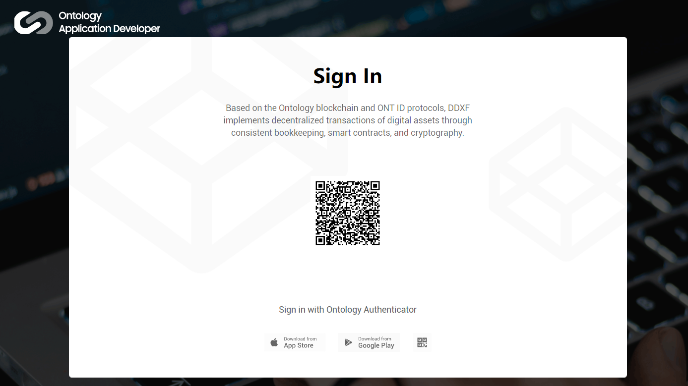

## Browsing the Add-on Library

The add-on library displays all the available pre-defined and custom add-ons. 

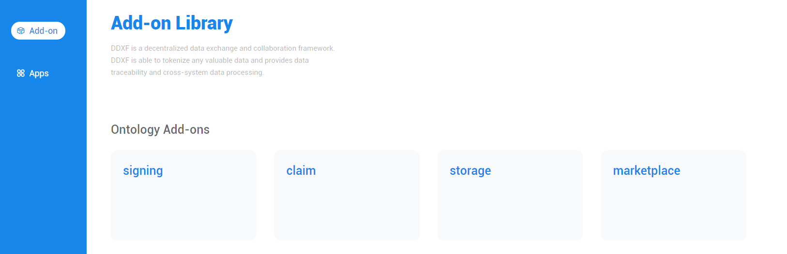

## Registering an Application

An application needs to be added to the add-on store in order to start the add-on integration process. SDK modules will be generated later based on the information provided when registering the app.

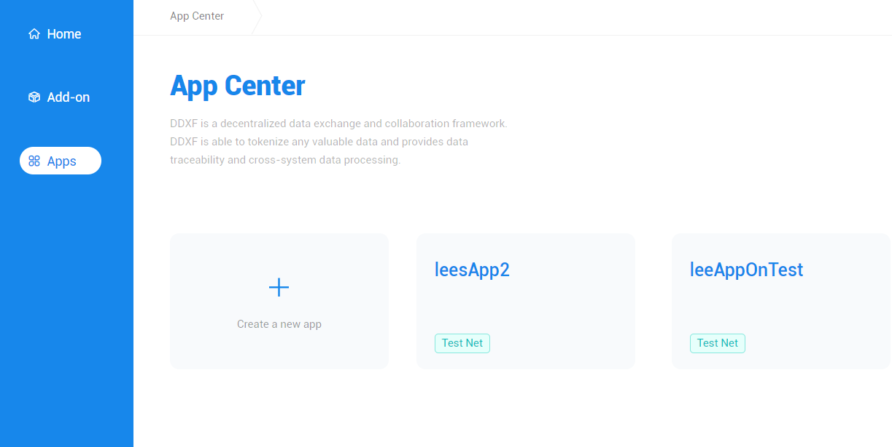

The app registration process is as follows:

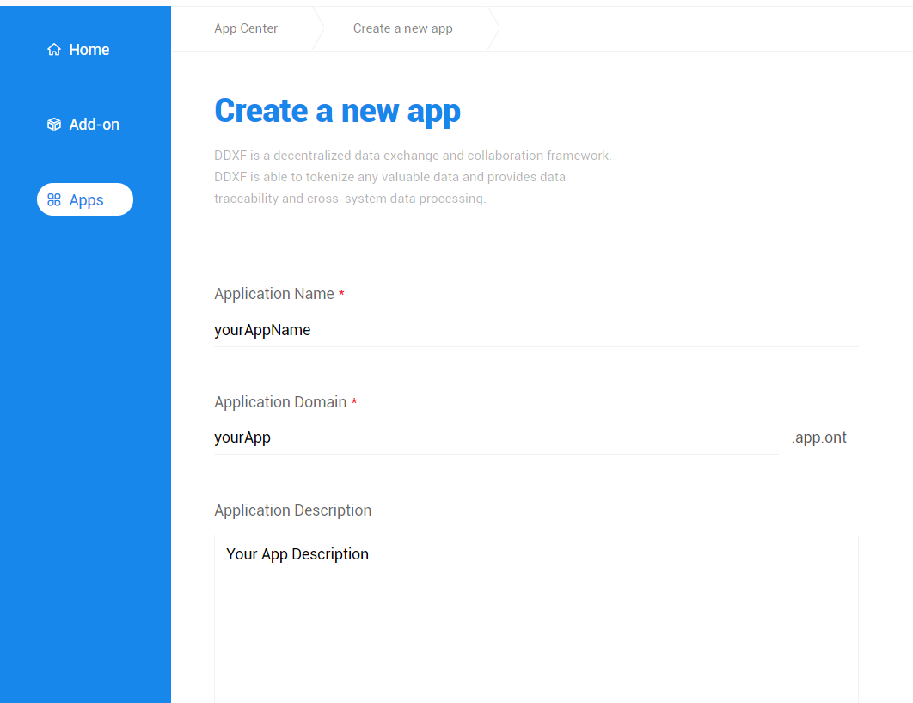

1. Fill in the relevant app related information.

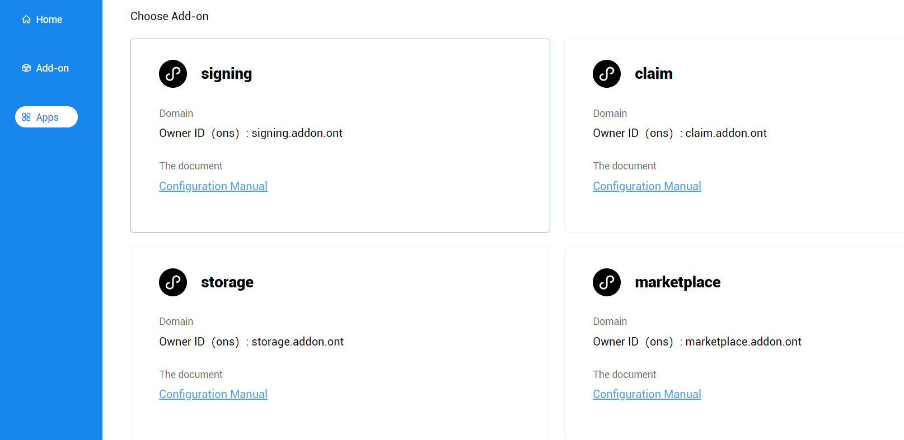

2. Choose the add-ons that need to be integrated in the application, and then carry out the necessary configuration for your application based on the add-on configuration template (Please refer to the configuration manual for more details).

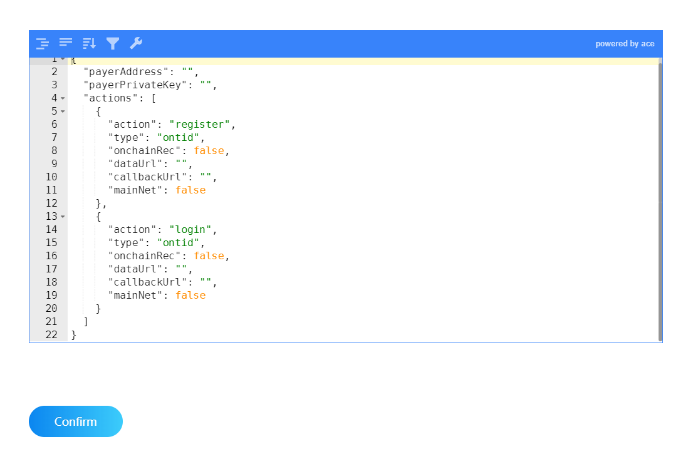

3. Once registration is successful the add-on store generates and assigns a unique ONT ID and a domain (ONS) for each application. Also, links to the respective SDK modules, the necessary `Config` files, or the add-on service URL for the add-ons selected for integration will also be displayed.

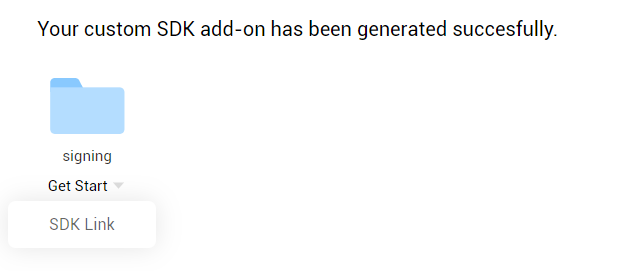

## Modifying Application Details

Basic application details except the associated ONT ID and the assigned domain can be modified. Developers may also choose to start over and add the required add-ons to an application and obtain the newly generated SDK modules, `Config` file, and service URL.

##  Add an Owner

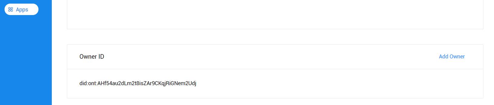

The developer can add their ONT ID as the **Owner** of an application. This allows the developer to use the private key of their ONT ID to sign the transactions in place of the application's ONT ID. 

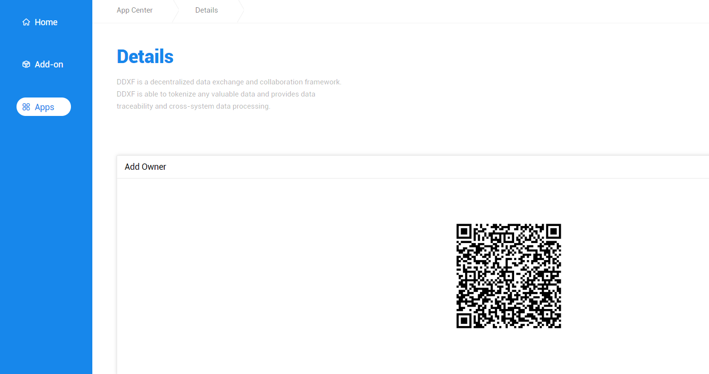

After the owner is added, the owner's ONT ID can be used to scan the resultant verification code.

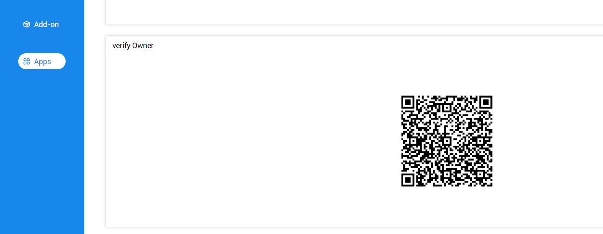

## Deploying on the Main Net

All the aforementioned operations are carried out on the test net. Once the developer has integrated the respective add-on functionality and after completing the integration testing, the application can be deployed to the Ontology Main net.

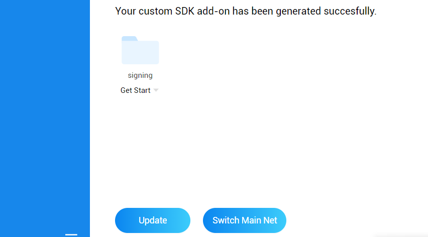

At this point, the application's ONT ID and domain can be registered on the main net. The user's ONT ID can be added as the **owner** of the app's ONT ID on the main net. All the add-ons that are part of the application are also configured to operate in the main net environment.