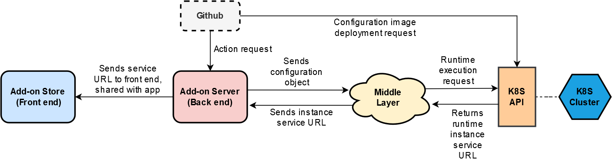

<h1 align=center> Add-on Deployment Guide </h1>

## Overview

This document describes the process involved in deploying an add-on, or updating previous configurations using Github. Once deployed, the add-on can be added to an application using the add-on store. We will go over the roles played by the different components that are part of the mechanism.

## Components and Structure



As illustrated in the figure above, components involved are:

- **Github:** The add-on index repository where the pull request is submitted and the action handles it.
- **Add-on Store (Front end):** The front end client of the add-on store that is used to add applications to the system and then add add-ons to applications.
- **Add-on Server (Back end):** The back end of the system that handles and processes requests from the add-on store and other parties.
- **Middle Layer:** A layer set in place to allow interaction with K8S cluster via the K8S API.
- **K8S API:** The communication interface between the add-on middle layer and the K8S cluster.
- **K8S Cluster:** The virtual machines that run the add-on containers.

## Process Flow

The entire deployment process can be divided into four major steps, as elucidated below.

### Step 1

First, the developer submits a pull request to the [Add-on index](https://github.com/ont-bizsuite/addon-index) repository on Github along with a JSON file that contains details with reference the add-on being deployed, or the updates that need to be made to an existing add-on. 

This JSON file contains the following data with respect to the particular add-on:

```json
{
  "owner": "did:ont:Adg3mfNAbfNwjvtbBSziZnXKKP3HbHNqM5",
  "meta": "",
  "addons": [{
    "domain": "witnessTest001.addon.ont",
    "image": "carltraveler/witness_server:v0",
    "runtimeImage": "carltraveler/witness_runtimev0:v6",
    "official": true,
    "imageProperties": {},
    "tag": "latest",
    "url": "option"
  }],
  "sig": "01c67e328a25ead5c038bfb2337cbef021224fc414204a1090c56298c22ad46939bbbb72fdd28c6f6005b3b681b6b03f19d181f4539a6a43e63be30b110b62a92c"
}
```

|    Field     | Description                                                    |
| :----------: | -------------------------------------------------------------- |
|    owner     | ONT ID of the add-on owner                                      |
|    domain    | Add-on URL                                                      |
|    image     | Add-on config image URL                                         |
| runtimeImage | Runtime image URL                                              |
|     sig      | Signature of the party performing the deployment/update action |

### Step 2

The pull request triggers the Github action. The Github action processes and handles the pull request. Primarily, there are two tasks performed by the Github action:

1. Verifies whether the signature submitted in the pull request JSON file is authentic
2. Sends configuration image deployment request to the **K8S API**

The **add-on server** upon receiving the request from the action first carries out signature verification. If the verification is successful, the action sends a request to the K8S API to deplot the configuration container and sends the received service URL to the add-on store. Once the configuration information is received by the add-on server, it is sent to the add-on store to be displayed on the front end.

Based on the configuration the add-on server determines whether the **runtime container** needs to be executed. If the runtime container needs to be executed, the server notifies the **middle layer** regarding the same.

### Step 3

The middle layer then uses the configuration JSON object to send a request to the **K8S cluster** via the K8S API to execute the runtime container. The K8S cluster executes the runtime image and the instance **service URL** is notified back to the middle layer via the same interface, which then sends it back to the add-on server.

### Step 4

The add-on server transfers the service URL to the **add-on store**, where the app can access it. Any further requests to the runtime from the app will be sent to the middle layer which will send proxy requests to the service URL where the particular action will be carried out by the runtime container.

At this point, the add-on can be added to the application and the **add-on back end** is ready to handle the requests sent to the runtime using the service URL.

> If there is no runtime to be executed, the add-on can be considered to be deployed when the add-on store receives the service URL that it obtained from the add-on server. This service URL is sent to the add-on server by the Github action, which obtains it in the response from the K8S API when the deployment request was sent initially


