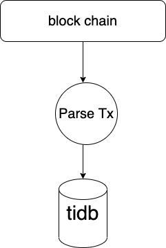

### BlockChain ParseTx Doc

## 1、BackGround
#### parse blockchain transfer info to db

  
 
 
## 2、Processing Flow
 
### 1、Sync Block
 
### 2、use http or rpc get every block or event log
### 3、parse block,parse event log
### 4、save transferin to tidb

## 3、 Redis Struct


```

 for every block chain 
 k:crypto coin type 
 value:blockHeight

 for eth
 k:eth 
 value:blockHeight
 
```

## 4、 db struct
 
 ```

1、eth tx table

| field name   |      type           |           comment               | null |
| -------------| --------------------| ------------------------------- | ---- |
| tx_info      | varchar(256)(PK)    |           txInfo                | N    |
| tx_hash      | varchar(256)(Index) |           txHash                | N    |
| from_addr    | varchar(128)(Index) |          fromAddr               | N    |
| to_addr      | varchar(128)(Index) |           toAddr                | N    |
| amount       | varchar(64)         |           amount                | N    |
| gas          | varchar(64)         |            fee                  | N    |
| block_height | bigint(32)          |        blockHeight              | N    |
| block_time   | int(11)(Index)      |         blockTime               | N    |
| call_type    | varchar(32)         |           type                  | N    |

2、erc20 tx table

| field name   |      type           |    comment                      | null |
| -------------| --------------------| ------------------------------- | ---- |
| tx_info      | varchar(256)(PK)    |       txInfo                    | N    |
| tx_hash      | varchar(256)        |       txHash                    | N    |
| content      | mediumblock         |       all log event data        | N    |
| block_height | bigint(32)          |       blockHeight               | N    |
| block_time   | int(11)(Index)      |       blockTime                 | N    |

3、btc tx table

| field name   |      type           |           comment               | null |
| -------------| --------------------| ------------------------------- | ---- |
| tx_info      | varchar(256)(PK)    |           txInfo                | N    |
| tx_hash      | varchar(256)(Index) |           txHash                | N    |
| from_addr    | varchar(128)(Index) |          fromAddr               | N    |
| to_addr      | varchar(128)(Index) |           toAddr                | N    |
| amount       | varchar(64)         |           amount                | N    |
| block_height | bigint(32)          |        blockHeight              | N    |
| block_time   | int(11)(Index)      |         blockTime               | N    |

4、bch tx table
 
 | field name   |      type           |           comment               | null |
 | -------------| --------------------| ------------------------------- | ---- |
 | tx_info      | varchar(256)(PK)    |           txInfo                | N    |
 | tx_hash      | varchar(256)(Index) |           txHash                | N    |
 | from_addr    | varchar(128)(Index) |          fromAddr               | N    |
 | to_addr      | varchar(128)(Index) |           toAddr                | N    |
 | amount       | varchar(64)         |           amount                | N    |
 | block_height | bigint(32)          |        blockHeight              | N    |
 | block_time   | int(11)(Index)      |         blockTime               | N    |
 
5、ont tx table
 
 | field name   |      type           |           comment               | null |
 | -------------| --------------------| ------------------------------- | ---- |
 | tx_info      | varchar(256)(PK)    |           txInfo                | N    |
 | tx_hash      | varchar(256)(Index) |           txHash                | N    |
 | from_addr    | varchar(128)(Index) |          fromAddr               | N    |
 | to_addr      | varchar(128)(Index) |           toAddr                | N    |
 | amount       | varchar(64)         |           amount                | N    |
 | block_height | bigint(32)          |        blockHeight              | N    |
 | block_time   | int(11)(Index)      |         blockTime               | N    |
 
 6、ong tx table
  
  | field name   |      type           |           comment               | null |
  | -------------| --------------------| ------------------------------- | ---- |
  | tx_info      | varchar(256)(PK)    |           txInfo                | N    |
  | tx_hash      | varchar(256)(Index) |           txHash                | N    |
  | from_addr    | varchar(128)(Index) |          fromAddr               | N    |
  | to_addr      | varchar(128)(Index) |           toAddr                | N    |
  | amount       | varchar(64)         |           amount                | N    |
  | block_height | bigint(32)          |        blockHeight              | N    |
  | block_time   | int(11)(Index)      |         blockTime               | N    |
 
7、op4 tx table
  
  | field name   |      type           |           comment               | null |
  | -------------| --------------------| ------------------------------- | ---- |
  | tx_info      | varchar(256)(PK)    |           txInfo                | N    |
  | tx_hash      | varchar(256)(Index) |           txHash                | N    |
  | contract_addr| varchar(128)        |          contractAddr           | N    |
  | tx_content   | blob                |          all tx event data      | N    |
  | block_height | bigint(32)          |        blockHeight              | N    |
  | block_time   | int(11)(Index)      |         blockTime               | N    |
  
8、wing tx table
  
  | field name   |      type           |           comment               | null |
  | -------------| --------------------| ------------------------------- | ---- |
  | tx_info      | varchar(256)(PK)    |           txInfo                | N    |
  | tx_hash      | varchar(256)(Index) |           txHash                | N    |
  | contract_addr| varchar(128)        |          contractAddr           | N    |
  | tx_content   | blob                |          all tx event data      | N    |
  | block_height | bigint(32)          |          blockHeight            | N    |
  | block_time   | int(11)(Index)      |           blockTime             | N    |
 
9、ontd tx table
  
  | field name   |      type           |           comment               | null |
  | -------------| --------------------| ------------------------------- | ---- |
  | tx_info      | varchar(256)(PK)    |           txInfo                | N    |
  | tx_hash      | varchar(256)(Index) |           txHash                | N    |
  | contract_addr| varchar(128)        |          contractAddr           | N    |
  | tx_content   | blob                |          all tx event data      | N    |
  | block_height | bigint(32)          |          blockHeight            | N    |
  | block_time   | int(11)(Index)      |           blockTime             | N    |
 
 10、wbtc tx table
   
   | field name   |      type           |           comment               | null |
   | -------------| --------------------| ------------------------------- | ---- |
   | tx_info      | varchar(256)(PK)    |           txInfo                | N    |
   | tx_hash      | varchar(256)(Index) |           txHash                | N    |
   | contract_addr| varchar(128)        |          contractAddr           | N    |
   | tx_content   | blob                |          all tx event data      | N    |
   | block_height | bigint(32)          |          blockHeight            | N    |
   | block_time   | int(11)(Index)      |           blockTime             | N    |
 
11、susd tx table
   
   | field name   |      type           |           comment               | null |
   | -------------| --------------------| ------------------------------- | ---- |
   | tx_info      | varchar(256)(PK)    |           txInfo                | N    |
   | tx_hash      | varchar(256)(Index) |           txHash                | N    |
   | contract_addr| varchar(128)        |          contractAddr           | N    |
   | tx_content   | blob                |          all tx event data      | N    |
   | block_height | bigint(32)          |          blockHeight            | N    |
   | block_time   | int(11)(Index)      |           blockTime             | N    |
  
 12、uni tx table
    
    | field name   |      type           |           comment               | null |
    | -------------| --------------------| ------------------------------- | ---- |
    | tx_info      | varchar(256)(PK)    |           txInfo                | N    |
    | tx_hash      | varchar(256)(Index) |           txHash                | N    |
    | contract_addr| varchar(128)        |          contractAddr           | N    |
    | tx_content   | blob                |          all tx event data      | N    |
    | block_height | bigint(32)          |          blockHeight            | N    |
    | block_time   | int(11)(Index)      |           blockTime             | N    |
      
13、dai tx table
   
   | field name   |      type           |           comment               | null |
   | -------------| --------------------| ------------------------------- | ---- |
   | tx_info      | varchar(256)(PK)    |           txInfo                | N    |
   | tx_hash      | varchar(256)(Index) |           txHash                | N    |
   | contract_addr| varchar(128)        |          contractAddr           | N    |
   | tx_content   | blob                |          all tx event data      | N    |
   | block_height | bigint(32)          |          blockHeight            | N    |
   | block_time   | int(11)(Index)      |           blockTime             | N    |
  
14、renbtc tx table
   
   | field name   |      type           |           comment               | null |
   | -------------| --------------------| ------------------------------- | ---- |
   | tx_info      | varchar(256)(PK)    |           txInfo                | N    |
   | tx_hash      | varchar(256)(Index) |           txHash                | N    |
   | contract_addr| varchar(128)        |          contractAddr           | N    |
   | tx_content   | blob                |          all tx event data      | N    |
   | block_height | bigint(32)          |          blockHeight            | N    |
   | block_time   | int(11)(Index)      |           blockTime             | N    |
  
15、usdc tx table
   
   | field name   |      type           |           comment               | null |
   | -------------| --------------------| ------------------------------- | ---- |
   | tx_info      | varchar(256)(PK)    |           txInfo                | N    |
   | tx_hash      | varchar(256)(Index) |           txHash                | N    |
   | contract_addr| varchar(128)        |          contractAddr           | N    |
   | tx_content   | blob                |          all tx event data      | N    |
   | block_height | bigint(32)          |          blockHeight            | N    |
   | block_time   | int(11)(Index)      |           blockTime             | N    |
  
16、usdt tx table
   
   | field name   |      type           |           comment               | null |
   | -------------| --------------------| ------------------------------- | ---- |
   | tx_info      | varchar(256)(PK)    |           txInfo                | N    |
   | tx_hash      | varchar(256)(Index) |           txHash                | N    |
   | contract_addr| varchar(128)        |          contractAddr           | N    |
   | tx_content   | blob                |          all tx event data      | N    |
   | block_height | bigint(32)          |          blockHeight            | N    |
   | block_time   | int(11)(Index)      |           blockTime             | N    |
  
```
