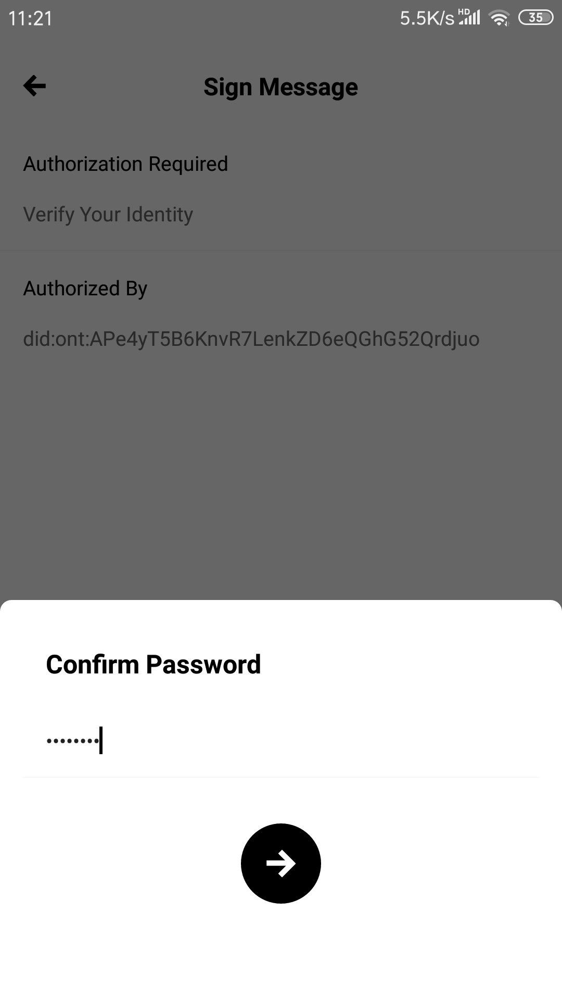

# ONT ID and DDXF

## 摘要

对于互联网应用来说，业务的本质是实现信息化数据的处理。应用有两个核心模块，业务（数据）处理模块和用户账号模块。

由于现阶段的数据大都以中心化的形式保存和管理，数据的使用不经过数据所有者（产生者）的授权，造成未经授权数据交易的作恶成本非常低。本体提供去中心化数据和身份体系，所有的数据使用都需要经过数字身份的确权，在有授权的情况下使用数据，数据处理的过程可以追溯，形成信任平台。

本体采用 ONT ID 和 DDXF 实现**去中心化身份体系**和**数据加工和交换确权**，满足应用用户账户的自主管理和业务处理的确权和追溯功能。

## ONT ID

Ontology DID (AKA: ONT ID) is a decentralized identification protocol which based on W3C DID specifications. It supports collaborative services such as distributed and diversified ownership confirmation, identification, and authentication of various entities including individuals, legal entities, objects, and contents. ONT ID establishes a cryptographically-based digital identity for each entity, allowing self-sovereign of data authorization and ownership confirmation, which makes the identity and data truly assets that the user can control. ONT ID has the characteristics of decentralization, self-management, privacy protection, security and ease of use.

Ontology establishes a decentralized trust model and distributed trust delivery system through ONT ID and verifiable claim, and uses the C-L signature algorithm and zero-knowledge proof protocol to assure privacy protection of verifiable claim. Through ONT ID, Ontology will also incorporate various authentication service agencies, and establish multi-source authentication of the entity’s identity to achieve complete identity portrait.

In addition to relying on specific central entities to build trust relationships, entities can also build equally strong trust relationships by themselves. Trust transfer is achieved through mutual authentication between entities. Entities will have higher credibility if they receive more authentications from other entities – especially if those other entities have high credibility.

### 1. Introduction

ONT ID framework is targeting to provide 

1. self-sovereign identity for web applications, to buy in end user(s) of web-apps as stakeholder(s), and,
2. a platform to match the targeting user(s) for web-app(s) via a collection of third party claims, which results as the trust mechanism of Ontology.

#### 1.1 Self-sovereign identity

In Ontology `ONT ID framework`, "entity" refers to individuals, legal entities (organizations, enterprises, institutions, etc.), objects (mobile phones, automobiles, IoT devices, etc.), and contents (articles, copyrights, etc.) in the real world, and "identity" refers to the entity's identity within the network. 

1. **ONT ID** `ONT ID(s)` are identifier(s) of ONT ID framework. All entities in Ontology system shall have an `ONT ID`. Ontology uses Ontology Identifier (`ONT ID`) to identify and manage the entities' identities. On Ontology blockchain, one entity can correspond to multiple individual identities, and there is no relation between multiple identities.
2. **ONT Auth** and **Signing server** `ONT ID` services are deployed to Ontology mainnet. Users own `ONT IDs`. To make full use of `ONT ID`, a mobile application `ONT Auth` is used to enable self-sovereign identity. A `signing server` is a server side service to bridge `ONT ID` from end user to account system inside web-app. 

##### Workaround for centralized business

In order to satisfy traditional web-app user experiences, some web-apps may start with centralized id business. ONT ID framework provides workaround solution to meet the requirement above.

The centralized identifiers are able to be handed back to the ONT ID owners, via change the  `Owner` of `ONT ID` DDO from web-app to the end user.

#### 1.2 Ontology trust mechanism (the claim system)

Entities issue claims and "sell" them to their customers, where there are verification scenarios. The close loop of issuing request, creation and consuming of claims setup the Ontology trust mechanim.

本体使用可信声明的技术实现信任机制。

To active the mechanism, the following components are setup in `ONT ID framework`.

1. **Trust anchor** Trust anchor refers to the partner that provides authentication services on the Ontology ecosystem. It may be government agencies, universities, banks, third-party authentication service agencies (such as CA agencies), biometric technology companies, etc.
   - **Verifiable Claim Protocol** A statement to confirm a claim made by one entity about another (including themselves). The claim is accompanied by a digital signature that can be used by other entities for authentication. The verifiable claim protocol describes in detail the procedures and specifications about issue, store, and verification of verifiable claim.
2. **Claim store** A `claim store` is an entity to provide service for "`claim owners`" to manage their claims online, notify `claim owner(s)` when there is `claim consumer` for certain credentials. A `claim store` is usually an entity with NDA to ensure data privacy.
3. **ONT Auth** As a mobile application, `ONT Auth` is able to manage personal claims.

本课程中，集中介绍自治身份。关于本体信任机制的课程，将在后续推出。

本课程中，将教会同学们使用 ONT ID 的组件实现传统互联网应用的账户管理模块（用户系统）的去中心化改造。

### 2. 环境部署

本体提供 ONT ID 的商用解决方案，在本课程中，集中介绍独立部署互联网应用去中心化身份改造的**去中心化身份应用服务器**。

使用 docker 安装 signing server

1. 手续费代付账户准备
   1. 配置 Gas 代付钱包，预存 ONG
      1. 可以自行部署同步节点 // TODO：下载链接和截图，如果没有，删除
      2. 监控钱包余额，不足时报警
2. 下载
3. 配置
4. 运行

// TODO: 补充命令行、下载链接和截图

docker run -p 8099:8099 -v /host_mnt/d/docker/signing-server/config/:/config -v /host_mnt/d/docker/signing-server/logs/:/logs --name signing signing-server_signing-server

（需要挂载配置文件application.properties）

### 3. 去中心化账户改造

去中心化账户改造的核心思想是：中心化账户体系不变，将账户体系和 ONT ID 公钥绑定，通过验证 ONT ID 私钥的签名来实现对应账户的鉴权工作。

#### 3.1 注册改造

1. 用户使用 ONT Auth 注册自我管理的`ONT ID` // TODO：下载链接和截图

2. *传统 web-app 注册流程，账户内容准备。比如，*
   1. 注册信息填写
   4. 老账户查重
   5. 新账户锁定，注册信息缓存
      - session 绑定缓存，过期删除
      - 由于异步返回，建议对账户锁定缓存
   
3. Web-app 使用 signing sdk 或调用 restful api  `verify` 接口，用返回的数据生成二维码。提醒用户安装 ONT Auth 并注册 `ONT ID`
   1. 预定义方法参数为：`register`
   
   2. // TODO：调用方法细节和链接，
   
   3. signing sdk: 调用方法 signingSdk.verify("register",null)
   
   4. restful api:  调用接口(GET) /api/v1/ontid/verify/register
   
   5. 获取返回数据中的result并根据result生成二维码（可通过插件生成）
   
      e.g:
   
      成功返回的数据：
   
      ```json
      {
          "action": "register",
          "error": 0,
          "desc": "SUCCESS",
          "result": {
              "domain": "on.ont",
              "action": "signMessage",
              "id": "211828f6-da17-4cb2-9a6d-0004018b8072",
              "params": {
                  "callback": "http://192.168.50.4:8099/api/v1/ontid/invoke",
                  "type": "ontid",
                  "message": "msg",
                  "ishex": false
              },
              "version": "v1.0.0"
          },
          "version": "v1"
      }
      ```
   
      根据result生成的二维码：
   
      
   
4. Web-app 使用signing sdk或调用restful api `result`接口，将上一步成功返回的id作为参数传入，轮询该action的执行结果 
   
   // TODO：方法细节和链接，截图
   
   signing sdk: 调用方法 signingSdk.verifyResult(id)
   
   restful api:  调用接口(GET) /api/v1/ontid/result/{id}
   
   此处id即上文的``"id": "211828f6-da17-4cb2-9a6d-0004018b8072"``
   
   1. 用户使用 ONT Auth 扫描二维码并签名，发送给signing-server // TODO: 操作截图
   
      
   
   2. signing-server 收到 ONT Auth 的签名数据并验证签名，若验证通过则会将用户使用 ONT Auth 签名的 `ONT ID` 返回给 web-app
   
      ```json
      {
          "action": "registerResult",
          "error": 0,
          "desc": "SUCCESS",
          "result": {
              "success": "1",
              "action": "register",
              "id": "211828f6-da17-4cb2-9a6d-0004018b8072",
              "ontid": "did:ont:APe4yT5B6KnvR7LenkZD6eQGhG52Qrdjuo"
          },
          "version": "v1"
      }
      ```
   
      
   
5. Web-app 自行将用户账号和 `ONT ID` 进行绑定，注册缓存信息转成用户账户信息 // TODO：代码

#### 3.2 登录改造

1. Web-app 使用 signing sdk 或调用 restful api 的 `verify`接口，用返回的数据生成二维码
   1. 预定义方法参数为：`login`
   
   2. // TODO：调用方法细节和链接，
   
   3. signing sdk: 调用方法 signingSdk.verify("login",null)
   
   4. restful api:  调用接口(GET) /api/v1/ontid/verify/login
   
   5. 获取返回数据中的result并根据result生成二维码（可通过插件生成）
   
      e.g:
   
      ```json
      {
          "action": "login",
          "error": 0,
          "desc": "SUCCESS",
          "result": {
              "domain": "on.ont",
              "action": "signMessage",
              "id": "c9ca1740-9699-425e-8e4c-efb44e476b32",
              "params": {
                  "callback": "http://192.168.50.4:8099/api/v1/ontid/invoke",
                  "type": "ontid",
                  "message": "msg",
                  "ishex": false
              },
              "version": "v1.0.0"
          },
          "version": "v1"
      }
      ```
   
      根据result生成的二维码：
   
      
   
2. Web-app 使用 signing sdk 或调用 restful api 的  `result`接口，将上一步成功返回的 id 作为参数传入，轮询该 action 的执行结果 
   
   // TODO：方法细节和链接，截图
   
   signing sdk: 调用方法 signingSdk.verifyResult(id)
   
   restful api:  调用接口(GET) /api/v1/ontid/result/{id}
   
   此处id即上文的``"id": "c9ca1740-9699-425e-8e4c-efb44e476b32"``
   
   1. 用户使用 ONT Auth 扫描二维码并签名，发送给 signing-server // TODO：链接，截图
   
      
   
   2. signing-server 收到 ONT Auth 的签名数据并验证签名，若验证通过则会返回给 web-app 成功结果，不通过则返回给 web-app 失败结果
   
      ```json
      {
          "action": "loginResult",
          "error": 0,
          "desc": "SUCCESS",
          "result": {
              "success": "1",
              "action": "login",
              "id": "c9ca1740-9699-425e-8e4c-efb44e476b32",
              "ontid": "did:ont:APe4yT5B6KnvR7LenkZD6eQGhG52Qrdjuo"
          },
          "version": "v1"
      }
      ```
   
      

#### 3.3 关键动作上链改造

1. 定义预设上链动作的模板 // TODO: 模板链接

   ```json
   {
   	"domain": "on.ont",
   	"enableONS": true,
   	"defaultPayer": "AFmseVrdL9f9oyCzZefL9tG6UbvhUMqNMV",
   	"actions": [{
   		"type": "register",
   		"onchainRec": false
   	}, {
   		"type": "login",
   		"onchainRec": false
   	}, {
   		"type": "sourcing",
   		"onchainRec": true,
   		"payer": "",
   		"qrcodeUrl": "http:192.168.50.4:8099/qrcode/",
   		"callback": "http:192.168.50.4:8099/callback/"
   	}]
   }
   ```

   

2. 判断是否上链还是作为验签和驱动动作 // TODO：举例和链接

   ```onchainRec```为true表示上链操作，false表示只需要验签

   上链操作需要同时配置```qrcodeUrl```和```callback```。

   1. web-app事先通过用户操作，保存好上链操作的交易参数并以``id``作为唯一标识，通过```qrcodeUrl```+```id```可以获取该参数。所以，在调用sdk或api接口时，需要加上id参数，即：

      signing sdk: 调用方法 signingSdk.verify("sourcing",id)

      restful api:  调用接口(GET) /api/v1/ontid/verify/sourcing?id=xxx

      获取返回数据中的result并根据result生成二维码（可通过插件生成）

   2. ONT Auth扫码获取交易参数并构造交易签名，发送给signing-server

   3. signing-server只负责对ONT Auth签名做验证，验签通过signing-server会通过配置的```callback```回调给web-app，由wep-app完成上链操作。

   3.如果 上链，实现上链动作的智能合约 // TODO：举例和链接

   自行部署智能合约

3. 实现上链动作的后续链外动作 // TODO：举例和链接

4. 自定义配置上链操作 // TODO: 文档模板和举例