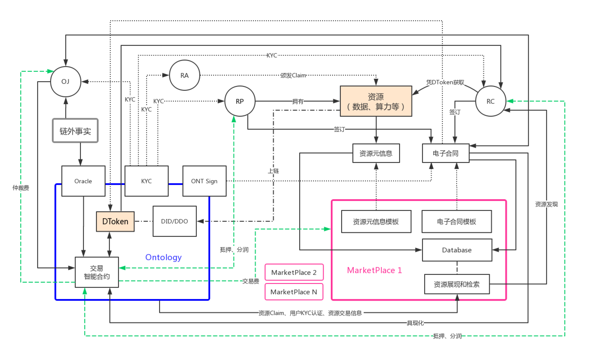
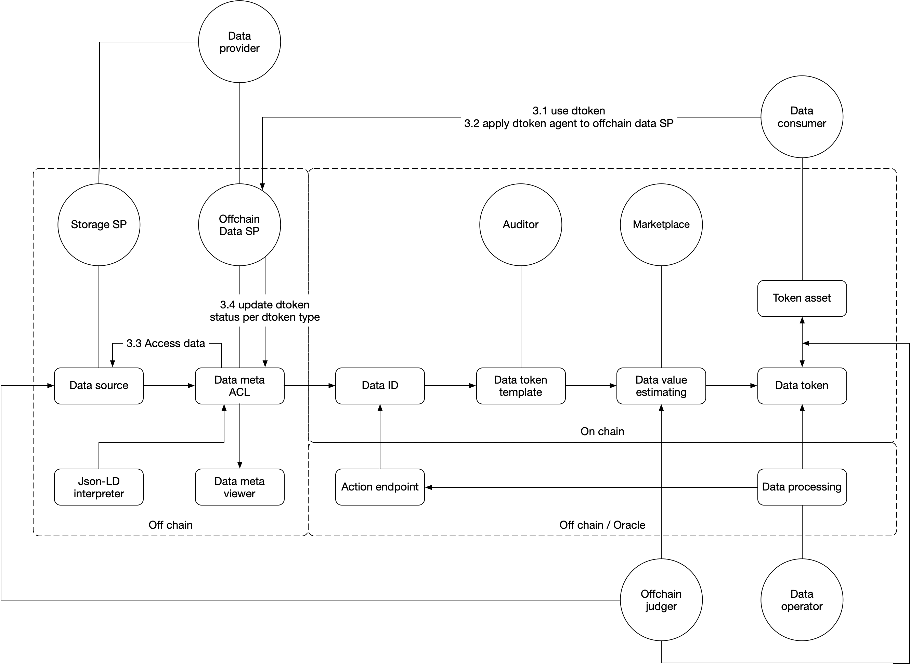
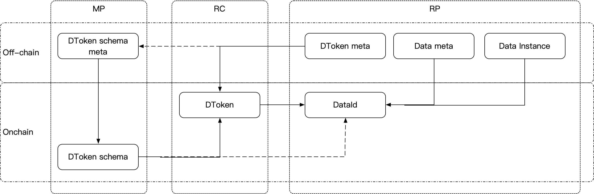
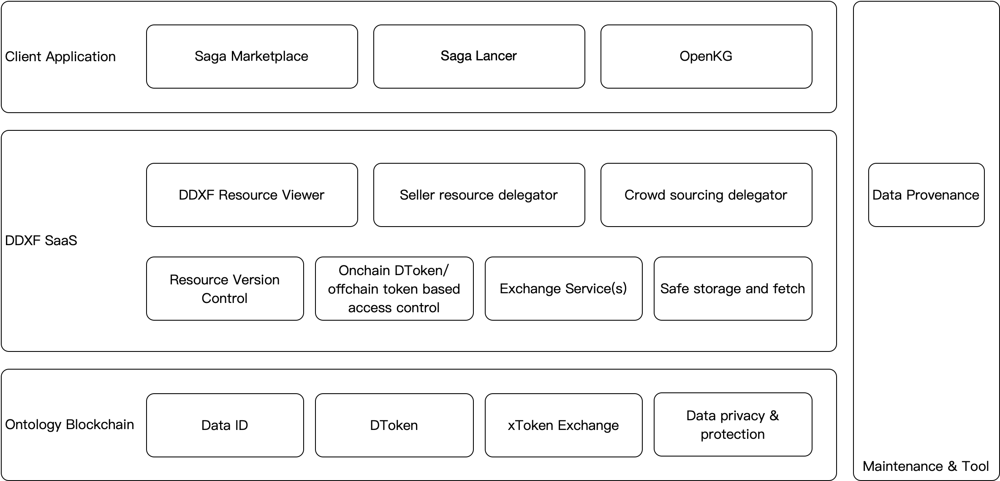
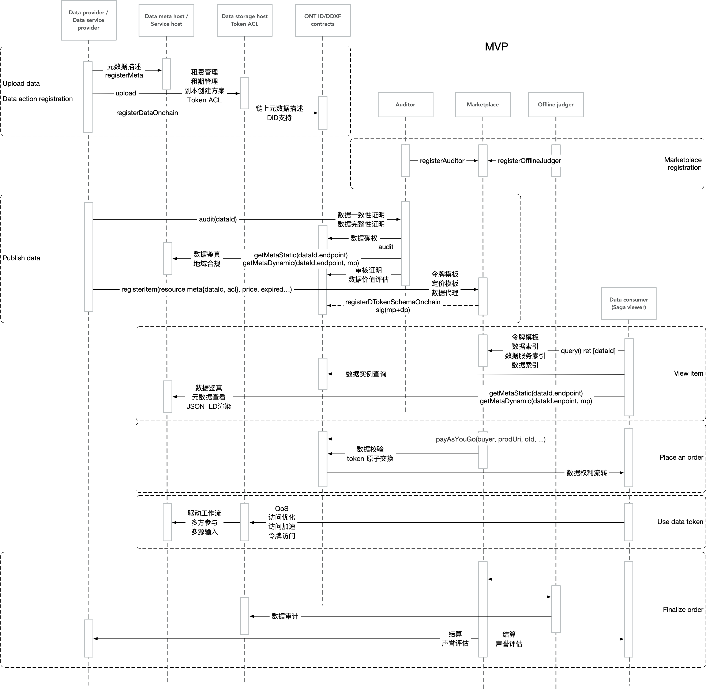
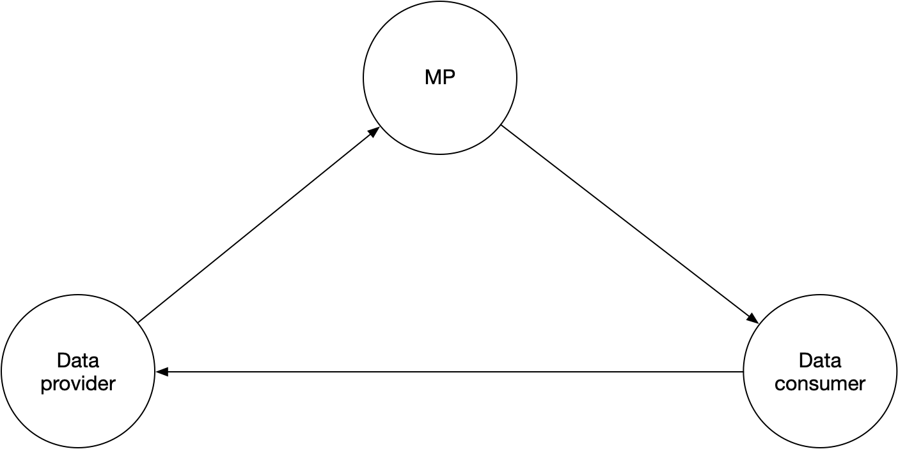
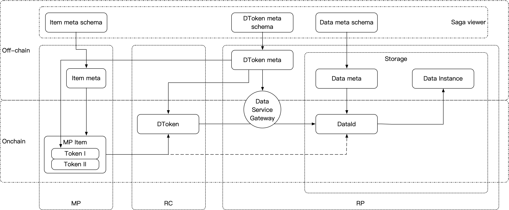
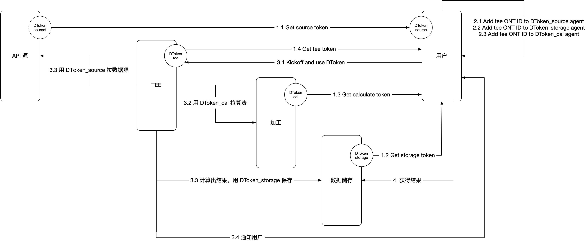

# DDXF

## Overview

### 概念架构



### 逻辑关系



### 静态模型



### 组件



### 流程



## OEP Candidates

### 基础协议

- OP-500 GREP v2.0
- [原型 ddxf-ifc](https://github.com/ont-bizsuite/ddxf-ifc)

### 最小化实现



### 链上

| OEP | 协议名称 | 备注 |
| -- | -- | -- |
| | DDXF                                       | |
| | Marketplace (pay as you go)                | |
| | Marketplace (仓储代销)                      | |
| | SplitFee                                   | |
| | DToken                                     | |
| | DToken Enhancement (OEP4)                  | |
| | DToken Enhancement (OEP5)                  | |
| | DToken Enhancement (OEP8)                  | |
| | Offline Judge                             | |
| | Offline Judge Enhancement (仲裁规则)      | |
| | Auditor                                    | |
| | Auditor Enhancement (Selective Disclosure) | |
| | Marketplace Enhancement (Auditor)          | |
| [OEP-37](https://github.com/xris-hu/DDXF-OEPS/blob/master/OEP-37.mediawiki) | Marketplace Enhancement (OJ)  | |
| | Data Provenance                            | |
| | Curation market                            | |
| | eContract                                  | |
| | 信用评价和管理协议（声誉标准）             | |
| | 跨MP信用互认协议                           | |

### 原生协议及工具

| 名称 | 备注|
| -- | -- |
| ONT ID 2.0                                     | |
| 可验证凭证规范                                   | |
| 多种标准的凭证可视化方案                           | |
| 信道加密（ONT ID TLS）                            | |
| 信源定向加密方案                                  | |
| 匿名声明                                         | |
| 隐私管理（物理隔断，多ONT ID主钥派生）               | |
| Claim传递                                       | |
| 多Token兑价方案                                  | |
| TEE资源评估和管理方案（数据算法和运行环境准备规范）    | |
| 数据自治管理——数据访问                               | |
| 跨链支付方案                                        | |
| 数据远程安全存储及安全转移推荐方法 （代理重加密）         | |
| 数据转换接口标准（interoperable object abstraction） | |
| 句法对齐标注（syntactic mediation）                 | |
| 语义对齐标注（semantic mediation）                  | |
| 基于令牌模板的工作流定义和令牌驱动工作流引擎             | |

### 链外 Meta Schema

可转化为建议实现的Proposal。

#### 1. 实现逻辑



#### 2. 数据类型

##### 2.1 文档数据源

```json
{
	meta: {
		id: "did:ont:xxx": data id of this data instance,
   		name: "name": name of the asset, the uri of the resource will be data://xxx/name,
   		type: dataset|action: enum, data service type,
   		created: 20200320T000000: create time,
   		license: "CC-0": resource license, "no license" for default,
   		author: "did:ont:xxx": author of the resource, could be ONT ID or ONS (as the time of created section),
   		owner: "did:ont:xxx": owner of the resource, could be ONT ID or ONS (as the time of created section),
   		resources: [{
   			uri: "storage://xxx/xxx": data storage uri,
   			contentType: "text/xml": file format,
   			<name: "": optional, resource name,>
   			<contentLength: 123: optional, size of the file in bytes,>
   			<index: 0: optional, start block number of resource, if necessary,>
   			<checksum: "md5:xxx": optional,	checksum of the file, algorithm:checksum,>
   			<encoding: "UTF-8": optional, file encoding,>
   			<compress: "zip": optional, compressed type,>
   			<encrypt: {
   				service: "data://xxx/action": service uri,
   				params:[{paramKey:val}]
   			}: optional, encrypt params, blank for not encrypted,>
			<extra: {}: optional, extra KV map>
   		}: dataset type, data item, represents as "data://xxx/datasetName#indexInResourceArray,
   		{
   			version: "0.1.0": version of the implementation of the action,
   			format: "docker|rpc|...": enum, docker to deploy locally, remote webservice call, rpc, etc.,
   			<language: "java": optional, SDK support,>
   			entrypoint: {
   				cmd: "abc $paramKey ...": command line to call the action,
   				image: "docker-image": docker image, uri,
   				<tag: "tag": docker tag>
   			}
   		}: action type, action item, represents as "data://xxx/actionName#indexInResourceArray,
   		]: resource of data service in one uri
   	}: resource meta
}
```

##### 2.2 Token描述

```json
{
   token: [{
	    "endpoint": "data://xxx/endpoints",
			"description": "resource description",
			"sla": "service level agreement reference",
			"permissions": {
				"read": true,
				"write": false,
				"create": false,
				"update": false,
				"delete": false
			}],
			<"response_type": "expected response type (singed url, ssh keys, OTP, etc)",>
			"expires": "date in seconds"
  }]: token acl from service provider
}
```

##### 2.3 ONT ID DDO, v2 spec
```json
{
  manager: "did:ont:xxx": data owner id,
  endpoint: "data://xxx#dataName": meta data service provider uri,
  hash: "xxxxxx": hash for data source
  <meta_hash: "xxxx": hash of meta description of data service, hash of json string in key alphabetical sequence,>
  ......
}
```

##### 2.4 商品挂单交互JSON-LD
```json
{
	"@context": {
		"gr": "http://purl.org/goodrelations/v1#",
		"pto": "http://www.productontology.org/id/",
		"foaf": "http://xmlns.com/foaf/0.1/",
		"xsd": "http://www.w3.org/2001/XMLSchema#",
		"foaf:page": {
			"@type": "@id"
		},
		"gr:acceptedPaymentMethods": {
			"@type": "@id"
		},
		"gr:hasBusinessFunction": {
			"@type": "@id"
		},
		"gr:hasCurrencyValue": {
			"@type": "xsd:float"
		},
		"mp": {
			"@id":"http://ont.io/ddxf#mp", 
			"@type":"@id",
			"@context": {
				"owner": {"@id":"http://ont.io/ddxf#owner", "@type":"xsd:string"},
				"marketplace": {"@id":"http://ont.io/ddxf#marketplace", "@type":"xsd:string"},
				"acl": {"@id":"http://ont.io/ddxf#acl", "@type":"xsd:anyURI"},
				"timespan": {"@id":"http://ont.io/ddxf#timespan", "@type": "xsd:dateTime"},
				"judgers": {"@id":"http://ont.io/ddxf#judgers", "@type": "xsd:array"}
            }
        }
    },
	"@id": "market://example.org/cars/for-sale/uuid",
	"@type": "gr:Offering",
	"gr:name": "Used Tesla Roadster",
	"gr:description": "Need to sell fast and furiously",
	"gr:hasBusinessFunction": "gr:Sell",
	"gr:acceptedPaymentMethods": "gr:Cash",
	"gr:hasPriceSpecification": {
		"gr:hasCurrencyValue": "85000",
		"gr:hasCurrency": "USD"
	},
	"gr:includes": {
		"@type": [
			"gr:Individual",
			"pto:Vehicle"
		],
		"gr:name": "Tesla Roadster",
		"foaf:page": "http://www.teslamotors.com/roadster"
	},
	"mp": {
		"owner": "did:ont:xxx",
		"marketplace": "did:ont:xxx",
		"acl": "data://xxx/yyy#acl-0",
    <"dataId": "did:ont:xxx",>
		"expired": "2021-04-09T20:00:00Z",
		"judgers": ["did:ont:xxx", "xxx"]
	}
}
```

##### 2.5 MP商品元数据
```json
{
	marketplace: {
		meta:{
			name: "displayed resource name",
			description: "resource description",
			<copyright: "copyright",>
			<published: 20200320T000000: published time,>
			categories: ["Other"],
			links: [],
			tags: [],
			<...>
		},
		dtoken_schema: [{
      <"dataId": "did:ont:xxx",>
      <"endpoint": "data://xxx#serviceName",>
      "acl_desc_hash": "xxx",
      "token": "data://xxx/data#acl-0": acl token,
			"marketplace": "market://example.org/cars/for-sale/uuid": marketplace uri of this DToken schema item,
      <"expireDate": xxx,>
      <"amount": 999>
		}]: data token schema to be sold
	}: meta infor for marketplace use, following json-ld form with schema validation
}
```

##### 2.5 JWT 转化
```json
{
	//Header
	{
		"alg": "HS256", // hashing algorithm
		"typ": "JWT"   // type of the token
	},
	//Payload
	{
		iss: "did:ont:xxx": (Issuer) Claim, ONT ID or ONS,
		sub: "name": (Subject) Claim,
		iat: 1516239022: (Issued At) Claim,
		exp: 1526790800: (Expiration Time) Claim,
		<nbf: 1516239022: optional, (Not Before) Claim,>
		<aud: "did:ont:xxx": optional, (Audience) Claim,>
		<jti: "xxx": optional, (JWT ID) Claim,>
		consumer_pubkey: "xxx": consumer Public Key, DToken holder address,
		<encrypt_pubkey": "xxx": optional, public key for encryption,>
		dtoken_hash: "xxx": DToken hash,
		resource_id": "market://xxx#id",
		<service_endpoint": "data://xxx#actionName-indexInResourceArray": optional, use data service to operate on data resource,>
		nonce": "<token_hex(32)>",
	},
	//Signature
	HMACSHA256(
		base64UrlEncode(header) + "." +
		base64UrlEncode(payload),
		Resource_owner_secret
	)
}
```

## 场景

### 买家

1. 数据源交易（以论文为例）
   1. 单论文无限次使用（所有论文贡献者分钱）
   2. 单论文有限次下载
   3. 单论文3天之内无限次下载
   4. 100篇论文下载
   5. 一个月用户无限次下载
   6. 引用论文参与分成（可迭代）
   7. 1-5 权限二手市场挂单【新场景】
2. 数据加工交易
   1. 论文查重服务（教师出售查重权、个人提供论文、在知网查重）【见数据加工方案文档】
3. 数据流交易
   1. 爱奇艺现场直播
   2. 爱奇艺会员
      1. 会员转售
      2. 会员流支付结算
      3. 二手市场
   3. 爱奇艺电影券、会员半价、零售单价；三天之内无限浏览

定义

- 数据meta schema
- 数据metadata
- 不同销售 DToken schema
- 使用和校验的 DToken
- MP挂单和展示的 renderer
- 明细meta展示的 renderer
- 具体数据的 renderer
- 不同场景的 MP；根据 DToken schema 到 DToken 的 MP 合约支持

每一项都需要从中心化到智能合约的方案

### 众筹（无 DToken）
1. 买家在平台上发起数据众筹，约定需要的Claim类型(和字段)，数量和价格，有效期等，并支付定金。
2. 平台生成众筹ID(可直接使用交易Hash)，发起交易将相关信息和定金写入众筹合约。
3. 通知claim持有者：
   a. 平台推送相关的众筹信息通知给claim的持有者;
   b. claim的持有者通过监听链上的合约事件获取众筹信息;
4. claim持有者通过获取到的众筹信息，检查是否匹配，匹配通过后根据众筹ID对应的接口(比如约定接口为：http://platform/ID/uploadClaim)发送数据。
5. 平台接收到claim后，进行验证。 待claim数量收集完毕后对所有的claim进行打包，计算出数据包hash，存放在约定的路径(比如http://platform/ID/getData）下。并往链上发送交易，调用众筹合约的完成方法，进行结算。
6. 买家通过http://platform/ID/getData下载claim数据。
7. 如果平台方无法完成，向链上发送取消交易，资金退回买家。

### 众筹（DToken版）

1. 买家在平台上发起数据众筹，约定需要的Claim类型(和字段)，数量和价格，有效期等，并支付定金。

2. 平台生成众筹ID(可直接使用交易Hash)，发起交易将相关信息和定金写入众筹合约。

3. 通知潜在客户：
   a. （ONTO入口）平台推送相关的众筹信息通知给 ONTO;
   b. （saga入口）saga market 监听链上的合约事件获取众筹信息，展示给用户，形成任务列表;

4. 潜在客户获取到众筹信息，检查是否有claim，如果没有，去对应TA获取（ONTO/ONT Auth）。根据模板生成 proof；

   a. （直接方案或托管方案，推模式，全量，完成后结算，传统模式的区块链实现）

     a.1. 通过后根据众筹ID对应的接口(比如约定接口为：http://platform/ID/uploadClaim)发送数据；平台接收到claim后，进行验证；

     a.2. 待claim数量收集完毕后对所有的claim进行打包，计算出数据包hash，存放在约定的路径(比如http://platform/ID/getData）下。并往链上发送交易，调用众筹合约的完成方法，进行结算。

   b.（marketplace方案，拉模式，两阶段，增量，随时结算，去中介化）

     b.1. claim 生成 ONT ID；选择 marketplace 挂单；（可托管数据到三方）；通知众筹接口（比如约定接口：http://platform/ID/claimCandidate）通知数据platform；

     b.2. 数据 platform 按需买数据，获得DToken，使用DToken拿到数据；

     b.3. 平台接收到claim后，进行验证。如果数据不对，发起挑战；

5. 买家通过http://platform/ID/getData下载claim数据。

6. 如果平台方无法完成，向链上发送取消交易，资金（增量为剩余）退回买家。

### 数据加工

1. 角色分：数据源、数据加工算法提供商、数据加工场所、数据结果保存商、客户
2. 实现实体分：数据源、Saga（数据加工算法提供商+数据加工场所+数据结果保存商）、客户
3. 商品上架：数据源、数据源匹配的数据加工算法（含加工场所和结果保存）
4. 客户浏览商品：查看数据源，推荐数据加工算法；查看数据加工算法，推荐数据源
   1. 数据源和数据加工算法强绑定
   2. 实际商品为：币安币价API（k线）+币价预测加工算法；OpenWeatherMap API（16天天气记录）+天气预测
   3. 用户选择api商品，推荐加工算法
5. 购买
   1. 用户购买 API，获得API访问 DToken_source
   2. 用户购买加工算法，获得加工算法 DToken_cal（含 DToken_tee、DToken_outputStorage）
6. 用户使用 DToken
   1. 用户授权，按照工作流装配环境（2.x），将 TEE 的 ONT ID 配置给各 DToken 的 agent
   2. 用户使用 DToken_tee，触发数据动作（3.x）
   3. TEE 线下装配工作流，使用 用户名下的 DToken_source/cal/storage 进行操作
      1. 准备环境
      2. 从加工方获得算法，DToken_cal 使用状态随之修改（如果商品定义有次数限制）
      3. 从数据源获得数据源，DToken_source 使用状态随之修改（如果商品定义有次数限制）
      4. 获得结果存入数据储存处，DToken_storage 使用状态随之修改（如果商品定义有次数限制）
   4. TEE 通知用户表示 DToken 使用完成，获得结果（储存的 expire date 策略在买 DToken_storage 时候就确定好）
7. 用户获取数据结果
   1. 用户获得结果（4.）
   2. 数据存入自己的储存空间
   3. 对于已经使用过的的 DToken，清理以节省链上 StateDB 空间

整体流程如下图。



注：极简实现中，TEE/加工/存储 为一个实体，简化实现逻辑。

DToken 添加 agent 字段。在不改变 DToken 所有者的情况下，使用 agent 签名一样可以通个链外鉴权；如果需要对 DToken 的使用进行链上计数，agent 同样有权限修改。

思考：agent 作恶的方案、应对的凭证和仲裁方案。

